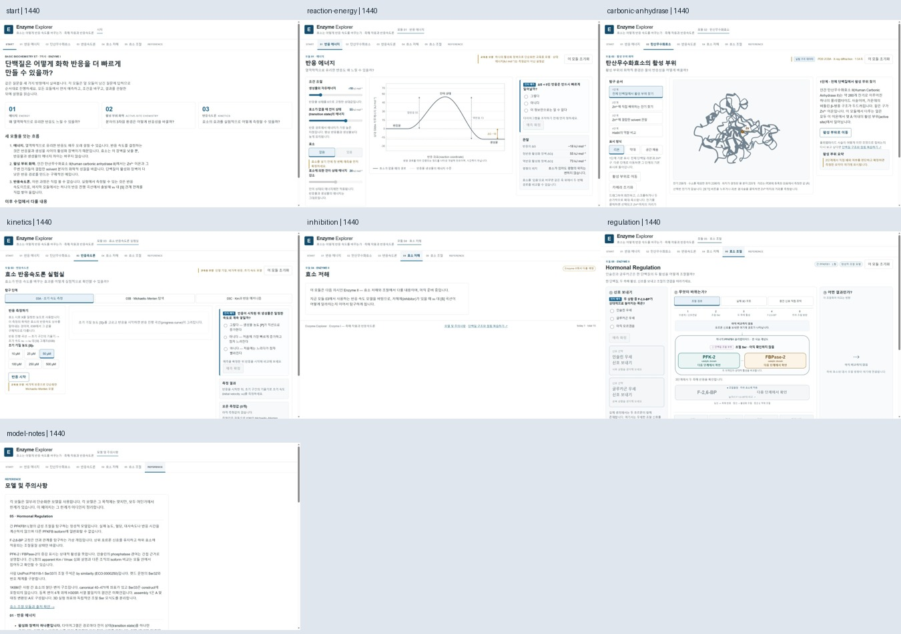
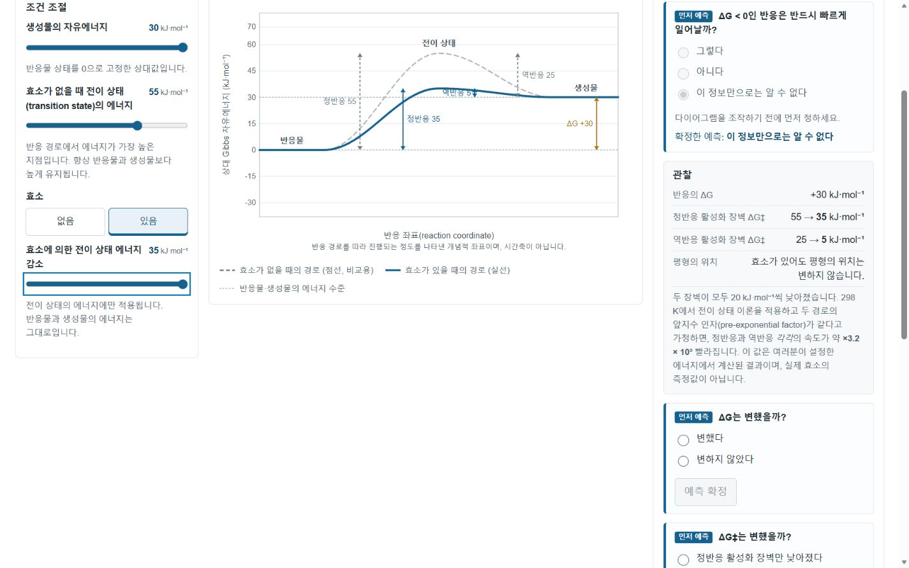

# Enzyme Explorer Site-wide UX Audit

감사일: 2026-10-01 (Asia/Seoul) · 공개 사이트: https://suimaire.github.io/enzyme-explorer/ · **감사만 수행, 앱 수정 없음**

## 1. Executive Summary

Enzyme Explorer는 예측 → 조작 → 관찰 → 설명의 학습 흐름과 실제 구조/교육용 모델의 구분이 강한 도구다. compact module rail은 현재 위치와 모바일 선택 항목을 잘 드러내며, 05의 3D 크게 보기는 수업 시연에 특히 적합하다. 검사한 42개 route/viewport 조합에서 페이지 가로 넘침이나 주요 요소의 수평 이탈은 발견하지 못했다. 그러나 모듈 왕복에서 측정값이 사라지고, 일부 입력 범위·해설 조건·비교 안내가 실제 동작과 어긋난다. 모바일에서는 화면이 깨지는 문제보다 조작과 피드백 사이의 거리가 크다.

잘 된 점:

1. 01에서 촉매는 반응물/생성물 에너지와 ΔG를 유지하고 정·역방향 장벽을 함께 낮춘다. 반응 좌표를 시간과 구분한다.
2. 02는 PDB 구조 좌표, Zn–원자 거리, 개념적 반응 단계, 물/수산화물 해석의 한계를 구분한다. 모바일 찾기 후 3D 이동과 목록 복귀가 있다.
3. 03은 Km과 Kd를 구분하고, Km을 affinity와 직접 동일시하지 않는다. [S] 변경은 읽는 점의 이동, [E]T·kcat 변경은 곡선 변경으로 설명한다.
4. 05는 한 단백질의 두 도메인, 상대 활성과 실제 flux의 차이, 간 isoform 범위, Ser33 모식도와 실제 3D construct의 차이를 명시한다.
5. 05 확대/축소에서 같은 canvas/context와 카메라 상태가 유지되고, ESC 후 포커스가 돌아온다. 반복 검사에서 종료 시 renderer 정리가 통과했다.

가장 중요한 개선점:

1. **UX-001:** Reference 왕복만으로 수집한 가상 측정값이 소실된다. 세션 상태 보존을 먼저 해결한다.
2. **UX-002:** 촉매 장벽 감소 입력 35와 실제 적용 20이 일치하지 않는 상태를 설명하지 않는다.
3. **UX-003:** Km > 150 µM에서 포화 해설을 여는 탐색 조건을 슬라이더 범위 내에서 만족할 수 없다.
4. **UX-004:** 비교 중 속도 축이 고정된다는 안내와 실제 재스케일 동작이 어긋난다.
5. **UX-006/007/008:** 작은 그래프 글씨, 일부 낮은 대비, 모바일 조작/질문/그래프의 분리를 함께 개선한다.

| Priority | 개수 | 해석 |
|---|---:|---|
| P0 | 1 | 수집한 세션 측정값 소실. 사이트 전체 불능이나 파일 데이터 손실을 뜻하지 않음 |
| P1 | 2 | 학습 진행 조건 또는 과학적 해석에 큰 영향 |
| P2 | 10 | 사용 가능하지만 혼란·불편·접근성 저하 |
| P3 | 3 | 준비 상태/범위 표시 및 resize 후 rail 노출 |
| 합계 | **16** | 동일 원인의 파생 현상은 중복 집계하지 않음 |

## 2. Audit Environment

| 항목 | 기준 |
|---|---|
| Repository | `D:\CODEX\260831 biochemistry\enzyme-explorer` |
| Branch | `main`, 원격 `origin/main` 추적. 변경하지 않음 |
| Remote | `https://github.com/suimaire/enzyme-explorer.git` |
| Commit SHA | `6d19656f77cf812b2001ef57328bc15e66871dac` |
| 마지막 commit | `6d19656 Improve module navigation and regulation structure layout` |
| 초기 working tree | clean |
| Browser | Windows의 연결된 Microsoft Edge. 정확한 버전/build는 수집하지 못함 |
| 공개 검증 | 위 GitHub Pages 사이트에서 모든 7개 경로 직접 진입·조작 |
| 로컬 검증 | 기존 Vite 앱 및 `tests/browser/regulation-harness.html` 재사용 |
| Viewport | **1600×900, 1440×900, 1280×800, 1024×768, 768×1024, 390×844** (CSS viewport override) |
| Persona | A: 효소를 처음 배우는 고1 / B: 반응속도론·조절을 일부 아는 고2 / C: 프로젝터로 시연하는 교사 |
| Reduced motion | 기존 harness의 JS `matchMedia` 분기 대체는 검사. **실제 브라우저 media condition 변경은 지원되지 않아 미검증** |
| 200% zoom | 브라우저 확대 키 입력 시도 후 viewport/DPR/visualViewport 변화가 없어 **200% 검증으로 인정하지 않음** |
| 작업 범위 | report, screenshot, DOM/측정/회귀 증거 파일만 생성. commit/push/branch/dependency 변경 없음 |

공개 DOM의 배포 asset 이름은 로컬 build의 `index-BtZ1Rdui.js`, `index-CFEvWvak.css`, `HormonalRegulation-B8okM2zU.css`와 일치했다. 이것만으로 공개 배포의 commit SHA를 독립적으로 증명했다고 주장하지 않는다.

### Baseline

| 검사 | 결과 |
|---|---|
| `npm test` | **10 test files / 174 tests passed** |
| `npm run typecheck` | 통과 |
| `npm run lint` | 통과 |
| `npm run build` | 통과 |
| Build warning | 500 kB 이상 chunk 경고: three 510.63 kB, ProteinStructure 582.20 kB. 실패와 구분. 이 경고만으로 성능 결함을 등록하지 않음 |
| Git 환경 경고 | 사용자 전역 ignore 파일 읽기 권한 경고. 앱 런타임 오류와 무관 |

방법: 실제 브라우저 관찰 → 입력/키보드/경계값/왕복 재현 → DOM 좌표·접근성 속성 확인 → 관련 소스 원인 조사 순으로 수행했다. 기능별 깊은 조작은 주로 1440×900 및 390×844에서, 기본 화면/rail/overflow는 전 6종에서 검사했다. 모든 상태를 모든 viewport에서 전수 조합했다는 뜻은 아니다. JPEG 캡처는 도구가 반환한 content 영역 크기이며, 파일 픽셀 크기가 scrollbar를 포함한 CSS viewport와 다를 수 있다.

원인 표기: **Observed**는 실제 화면/조작에서 확인한 사실, **Likely cause**는 코드 정황만으로 추정한 원인, **Confirmed cause**는 재현 결과와 해당 구현을 대조해 확인한 원인이다. 등록한 16건은 관련 구현을 대조했으므로 Confirmed cause로 표시했다. 실제 기기에서의 영향 크기·장시간 성능 등 미확인 판단은 원인 확인과 별개이며 Unverified에 남겼다. 코드 스타일만 보고 UX 문제를 추가하지 않았다.

## 3. Page Inventory

실제 registry는 `src/app/modules.ts`, 렌더링은 `src/app/App.tsx`에서 확인했다. 모든 아래 경로를 공개 브라우저에서 열었다.

| Route | 상태/주요 기능 | 실제 감사 범위 |
|---|---|---|
| `#/start` | 시작, 01–03 학습 카드, 학습 흐름, 후속 과정 안내 | 카드/rail 이동, 복귀, 첫 화면·끝까지 스크롤 |
| `#/reaction-energy` | 반응 에너지, 생성물/전이 상태/촉매 감소 슬라이더, 촉매 on/off, 예측·해설, 초기화 | 최소/최대/조합, ΔG·정역 장벽·속도 배율, 예측 확정, 촉매 비교, 초기화 |
| `#/carbonic-anhydrase` | 4 탐구 단계, PDB 2CBA 3D, 3 표현 모드, 활성 부위/잔기 찾기, 거리·배위 탐구 | 단계 전환, 6 잔기 찾기/답변, 표현·카메라 초기화·키보드 회전/확대, 모바일 이동/복귀 |
| `#/kinetics` | 03A 초기 속도, 03B MM 탐색(A 포화/B 효소 2배/C Km), 03C 메커니즘 | 농도별 실행·측정·반복, 조건/기준 곡선/슬라이더, 측정값 전달·조건 복원, 예측/해설·초기화·왕복 |
| `#/inhibition` | **예정 안내 화면** | 실제 진입, 예정 상태·후속 학습 안내·rail/모바일 |
| `#/regulation` | 경로/실험 개입/실제 구조, 호르몬 5단계, clamp, 확대·당인산 비교 dialog, 인산기 전달, 심화·출처 | 예측, 두 호르몬, 재생/정지/이전/다음/재시작, 개입·호르몬 상태 복귀, 구조 범위·확대, dialog/ESC, 전달 A/B, disclosure |
| `#/model-notes` | 05/01/02/03 모델 범위·출처·주의사항 | 모듈/푸터에서 이동, 문서 전체 스크롤, 정보 구조/출처 확인 |

추가 사용자 route는 발견하지 못했다. 알 수 없는 hash는 Start로 fallback한다. 03A/B/C 및 05의 보기들은 동일 route 안의 상태다. 당인산 비교와 크게 보기는 modal이며 별도 URL이 없다. 기존 `tests/browser/regulation-harness.html`은 개발용 fixture로 route 수에 포함하지 않았다.

**04에는 competitive/uncompetitive/mixed, Ki, Km_app/Vmax 비교, Lineweaver–Burk, nonlinear fit이 구현되어 있지 않다.** 이를 존재하는 기능처럼 감사하거나 오동작으로 등록하지 않았다. 03에도 사용자 데이터 fitting, noise 설정, 독립적인 반복 측정 데이터셋이 없다. 모델 곡선과 가상 측정값의 비교를 검사했다.

## 4. Cross-site Findings

### Navigation / layout / buttons

rail 순서와 active underline이 전 경로에서 일관되고 `aria-current`가 설정된다. 390px에서 **route를 변경하면** active item이 보이도록 rail이 가로 스크롤된다. 반면 같은 route를 유지한 채 desktop→mobile로 폭을 줄이는 캡처에서는 현재 항목이 숨는 상태가 보였다(UX-016). 이 rail의 의도된 가로 스크롤은 **페이지 overflow와 다르다**. 긴 한글 제목은 줄바꿈되며 겹침을 확인하지 못했다. 키보드 Tab/Shift+Tab, Enter/Space, 슬라이더 방향/Home/End 입력이 동작하고 표시된 값이 갱신된다. 포커스 outline은 관찰 사례에서 2.4px solid이며 배경과 구별된다.

모듈 badge → h2 → 안내 → 실험 영역의 위계, 밝은 카드·border·radius, 파란 선택 상태, 보조 초기화 버튼은 대체로 일관된다. 문제는 모든 패널을 같은 디자인으로 만드는 일이 아니라, **세션 상태 보존(UX-001), 이동 후 본문 진입(UX-012), Start의 실제 모듈 범위(UX-011)**다. 04 예정 상태는 접근성 이름에 있으나 rail의 시각 표시는 부족하다(UX-014). 05는 Enzyme II인데 공통 footer는 Enzyme I이다(UX-015).

disabled 조작은 대체로 가까운 설명이 있다. 01의 촉매와 05 호르몬은 예측 확정 후 활성화되고, 02 배위 해설은 6개 답변이 필요하다. 03B 포화 해설의 조건만 일부 범위에서 도달 불가능하다(UX-003). 초기화와 재생/처음부터는 서로 다른 행동이며 이번 검사에서 뒤섞이지 않았다. **다른 모듈로 이동하는 것을 암묵적인 초기화로 취급하는 동작은 별도 문제**다.

### Responsive / scroll / density

아래는 기본 진입 상태의 문서 높이(px)다. viewport 높이와 비교할 수 있도록 전체 숫자를 남겼다. 실제 하단 스크롤은 390×844에서 전 경로 확인했다([기록](site-wide-ux-audit/scroll-bottom-checks.json)).

| Route | 1600×900 | 1440×900 | 1280×800 | 1024×768 | 768×1024 | 390×844 |
|---|---:|---:|---:|---:|---:|---:|
| Start | 1050 | 1050 | 1075 | 1075 | 1270 | 1915 |
| 01 | 1022 | 1043 | 1087 | 1506 | 1596 | 2306 |
| 02 | 1210 | 1210 | 1276 | 1633 | 1779 | 2654 |
| 03 | 1150 | 1150 | 1193 | 1345 | 1484 | 2280 |
| 04 | 900 | 900 | 800 | 768 | 1024 | 844 |
| 05 | 1407 | 1407 | 1407 | 1408 | 1795 | 2654 |
| Reference | 2889 | 2889 | 2889 | 2889 | 3147 | 5602 |

42개 기본 화면에서 `scrollWidth <= clientWidth`, 조사 대상 중요 요소의 수평 이탈 0건이었다. text clipping/버튼 겹침/그래프가 카드 밖으로 나옴/고정 요소 충돌은 관찰한 화면에서 발견하지 못했다. **모든 숨은 상태까지 결함 0건이라고 일반화하지 않는다.**

390px의 공통 header와 rail이 약 266px을 차지한다. 01은 그래프 y≈531, 조작부 y≈936, 질문·관찰 y≈1487, 해설 y≈2082로 이어진다. 잠긴 촉매를 본 뒤 아래 질문으로 내려가고, 다시 조작부로 올라온 뒤 그래프를 확인해야 한다(UX-008). 03도 workspace 우선 배열로 비슷한 왕복이 있다. 02는 찾기 → viewer 자동 이동 → 목록으로 돌아가기라는 보완이 있으므로 동일 결함으로 등록하지 않았다.

05 desktop 관찰 패널에는 약 445px의 내부 스크롤 영역이 있고 page scroll도 존재한다. 역할을 나누어 내용을 밀집시킨 결과지만 결과가 더 있음을 놓칠 위험은 있다. 실제 결론의 누락이나 조작 불능은 재현하지 않아 독립적인 P1/P2 이슈로 세지 않았다. 모바일 기본 화면에서는 패널이 세로로 펼쳐진다. viewer의 wheel 확대는 패널 스크롤과 다른 조작이다. 실기기 touch에서의 충돌은 미검증이다.

### Graphs / 3D / projector

01의 두 장벽·ΔG, 03의 점선 기준 곡선·마름모 측정값, 05의 실선 반응/점선 조절·억제 기호는 색 외의 구분을 제공한다. 색만으로 모든 의미를 전달한다는 결함은 확인하지 못했다. 반면 그래프의 핵심 축/라벨은 본문보다 작다(UX-007). 1440×900에서 글씨 크기를 확인했지만 실제 프로젝터 2–4m 거리 테스트를 했다는 뜻은 아니다.

01 일반 SVG 텍스트 12px 중 장벽 색 `rgb(107,122,133)`/white는 **4.423:1**, ΔG 색 `rgb(168,118,28)`/white는 **3.982:1**로 일반 텍스트 4.5:1 기준에 미달한다(UX-006). 같은 그래프의 tick 색 `rgb(81,99,111)`는 6.242:1로 통과한다. disabled 요소나 모든 차트 전체에 실패를 확대 적용하지 않았다. 기준: [W3C Contrast Minimum](https://www.w3.org/WAI/WCAG22/Understanding/contrast-minimum.html).

05 모바일 기본 3D canvas는 약 320×437px, 확대 dialog는 약 375×760px 안에서 canvas 352×524px였다. 확대 controls는 44px 높이였고 가로 이탈이 없었다. 카메라/선택/요약 유지가 확인되었다. 02와 01/03에는 같은 크게 보기 기능이 없어 수업용 가독성 개선 여지가 있지만 모든 모듈에 새 presentation mode를 추가하라고 요구하지 않는다. 우선 글씨·배치·필요한 초점 이동을 고친 뒤 결정한다.

### Accessibility

| 검사 | 관찰 결과 | 한계/이슈 |
|---|---|---|
| Tab / Shift+Tab / Enter / Space | rail, 버튼, 예측, disclosure의 키보드 조작 가능 | route 이동 후 main에 진입하는 경로 개선 UX-012 |
| 슬라이더 키보드 | 값·단위 표시와 그래프 갱신 확인 | 실제 touch drag/pinch 미검증 |
| 현재 선택 | rail `aria-current`, segmented 및 구조 control `aria-pressed` 확인 | 모든 OS 보조기술 낭독 검증 아님 |
| 포커스 표시 | visible outline 관찰 및 캡처 | 모든 색상 상태 전수 대비 검사 아님 |
| 05 크게 보기 dialog | ESC, Tab/Shift+Tab wrap, 트리거 복귀 통과 | 기존 harness + 공개 직접 검사 |
| 05 당인산 비교 dialog | 열림/닫힘·ESC 가능 | ESC 후 focus=BODY, UX-009 |
| 그래프 대체 설명 | accessible graph label에 축·주요 값·조건 포함 | canvas 원자 포인터 선택과 screen reader 사용성은 별도 실험 필요 |
| 색 외 구분 | 점선/기호/텍스트·현재 값 제공 | 색각 이상 실제 사용자 검증 미실시 |
| 일반 텍스트 대비 | 01 일부 SVG 텍스트 미달 | UX-006, 전체 WCAG 인증 판단 아님 |
| Reduced motion | fixture의 JS 분기 확인 | 실제 CSS media condition 미검증 |
| 200% zoom | 입력 시도했으나 실제 확대 확인 실패 | 합격 처리하지 않음 |

modal 종료 후 트리거 복귀 권고는 [W3C Dialog Pattern](https://www.w3.org/WAI/ARIA/apg/patterns/dialog-modal/), 문맥을 유지하는 탐색 순서는 [W3C Focus Order](https://www.w3.org/WAI/WCAG21/Understanding/focus-order)를 참고했다. 이 감사는 WCAG 전체 인증이나 모든 screen reader 호환성을 주장하지 않는다.

### Scientific communication

촉매/평형, Km/Kd, 좌표 구조/원자 궤적, 상대 활성/단백질 양/실제 flux, 두 촉매 도메인/두 단백질의 구분은 대체로 명확하다. 04가 placeholder이므로 저해 유형을 과도하게 일반화하는 표현이나 저해 모델 계산을 평가할 자료가 없다. 현재 구현 범위에서 **심각한 과학 계산 오류는 재현하지 못했다**.

UX-002/004/005는 모델의 계산이 틀렸다기보다 입력·비교·측정이라는 UI가 결과의 성격을 정확히 전달하지 못하는 문제다. UX-013은 ATP→ADP 전환 뒤 역할 caption을 갱신하지 않는 국소적 과학 표기 오류다. 01의 교육용 에너지와 표준 자유에너지/평형상수의 구분은 Reference를 함께 읽을 필요가 있다. 일반적인 표준 관계는 [IUPAC 정의](https://www.old.goldbook.iupac.org/html/S/S05915.html)를 참고했다. 앱의 임의 설정값을 실측 ΔG나 생체 내 농도 평형으로 해석하지 않도록 기존 한계 설명을 보존한다.

구조 원자료 확인: [RCSB 2CBA](https://www.rcsb.org/structure/2CBA) 및 [RCSB 1K6M](https://www.rcsb.org/structure/1K6M). 구조 entry 메타데이터를 확인했으며 모든 연결 논문 원문까지 독립 검토하지 않았다.

### Performance / lifecycle / console / network

| 검증 | 결과 | 해석 |
|---|---|---|
| 공개 02 → Start | **25회 완전 왕복**. 진입 시 connected canvas 1, 나갈 때 0 | DOM canvas 누적 없음. heap 누수가 없다는 증명은 아님 |
| 기존 05 UI regression | 12 modal open/close × 2회 = **24회**. 두 실행 모두 `ALL UI CHECKS PASSED` | 동일 canvas/context 재사용, 카메라/선택·레이아웃 유지, 포커스/scroll 복구 |
| Harness context 누계 | 1회 끝 created=2/lost=1/connected=0; 2회 끝 3/2/0 | 지원 확인 probe 포함. 두 실행 간 +1 renderer context/+1 lost. modal 반복에 따른 증가 없음 |
| Module exit | renderer dispose 및 context lost 검사 통과 | 기존 fixture instrumentation 재사용, 앱 수정 없음 |
| 기존 단위 테스트 | 174 통과, lifecycle 관련 cleanup 포함 | 실제 장시간 heap/RAF/timer/listener 계수 관찰을 대체하지 않음 |
| 공개 console | 저장한 warn/error 기록 0건, stress 후도 0건 | 캡처된 브라우저 세션 범위. 모든 네트워크 응답/HAR 전수 아님 |
| 구조/asset | 방문한 경로에서 3D와 lazy module 로드 성공. 눈에 보이는 asset 실패 없음 | 404 전수 네트워크 로그는 확보하지 못함 |
| 외부 의존성 | 방문수 script `https://suimaire.github.io/assets/js/page-views.js`; 학습 모델·구조 asset은 저장소 안에서 제공 | 외부 카운터 장애 시 동작은 차단 환경에서 미검증 |
| Service Worker | 소스에서 등록/정책을 발견하지 못함 | cold offline 성공 주장 없음, cache architecture 변경 없음 |

초기 02+05 혼합 반복 호출 한 번은 브라우저 제어 도구의 60초 제한에 걸려 결과를 얻지 못했다. 앱의 성능 오류나 성공 회수로 집계하지 않았다. 복구 후 위의 25회/24회 완료 결과만 사용했다. RAF·timer·event listener·stale async load의 누적이나 memory 증가를 직접 프로파일링하지 않았으므로 추측성 최적화 이슈를 등록하지 않았다.

## 5. Page-by-page Findings

각 표의 A–H는 첫인상/다음 행동, navigation, 정보 구조, interaction, 시각 위계, responsive, 접근성, 과학 표현을 뜻한다.

### START — `#/start`

첫 viewport: desktop에서는 큰 질문, 소개, 01–03 카드와 학습 설명 일부가 보인다. 390px에서는 큰 질문·소개·01 카드와 02 시작 부분이 보이며 03은 아래다. 하단까지 내려 후속 과정과 footer를 확인했다.

| 관점 | 판단 |
|---|---|
| A | 질문과 세 가지 학습 방향은 명확. 읽지 않고도 카드 제목으로 01–03 진입 가능 |
| B | Start 복귀와 active rail 정상. 왕복 시 실험 상태 소실은 UX-001 |
| C | Energy → active-site → kinetics 순서가 자연스러움. 사용 가능한 05가 소개에서 누락, UX-011 |
| D | 큰 카드가 안정적으로 클릭 가능, 과도한 CTA 없음 |
| E | 제목·카드 번호·질문 위계가 일관됨. 01–03이 같은 수준으로 보임 |
| F | 한 열로 쌓이며 overflow 없음. 모바일 header 비중이 큼 |
| G | 링크 이름과 focus 표시 확인. main 바로 진입 개선 UX-012 |
| H | Enzyme I 범위 설명은 적절하지만 사이트 전체 제공 범위와 차이 UX-011/015 |

### 01 Energy — `#/reaction-energy`

첫 viewport: desktop에서 슬라이더·그래프·첫 예측/관찰을 함께 볼 수 있다. 390px는 제목·한계 설명·초기화·그래프까지, 슬라이더와 예측은 아래다. 그래프는 정적인 에너지 diagram이며 별도의 시간 animation/replay 기능은 없다. 교사가 상태를 유지해 설명하는 데 정지 조작은 필요하지 않는다.

| 관점 | 판단 |
|---|---|
| A | 예측 확정 후 촉매를 비교하는 의도 명확. mobile은 prerequisite 발견이 늦음 UX-008 |
| B | rail·초기화 정상, route 왕복이 상태 초기화로 작동 UX-001 관련 |
| C | 조건/그림/관찰 3열이 desktop에서 효과적 |
| D | 생성물·전이 상태·감소 범위 Home/End, 촉매 off/on, 예측/해설 및 reset 수행. 경계 조합에서 입력/적용량 불일치 UX-002 |
| E | 반응물·생성물·전이 상태·촉매 곡선 구분. 라벨 작음 UX-007 |
| F | graph가 viewport 밖으로 넘치지 않음. 조작과 그래프가 분리 UX-008 |
| G | 슬라이더 label/값·keyboard 및 graph accessible 설명 확인. 일부 일반 텍스트 대비 UX-006 |
| H | 촉매로 ΔG가 바뀌지 않음, 정·역 장벽 모두 하강. 물리적 clamp는 맞지만 입력과 적용 차이 미설명 UX-002 |

### 02 Carbonic Anhydrase — `#/carbonic-anhydrase`

첫 viewport: desktop에서 4단계 목록, 첫 단백질 구조, 단계 설명이 나란히 보인다. 390px에서는 구조 상부와 Zn 표식이 보이고 단계·찾기 조작은 아래로 이어진다. 첫 구조는 전체 단백질 문맥을 보여주며 활성 부위 focus로 확대할 수 있다. 단계는 수동으로 선택하므로 너무 빨리 지나가지 않는다.

| 관점 | 판단 |
|---|---|
| A | 단계 이름과 활성 부위 이동 버튼이 학습 목적을 드러냄 |
| B | 단계/잔기 선택이 표시됨. mobile 찾기 후 3D 자동 이동과 목록 복귀 확인 |
| C | 전체 구조→Zn 배위→물/반응→His64 순서, 2D 문구와 구조 탐색 연결 |
| D | ribbon/stick/spacefill, 활성 부위 focus, camera reset, 실제 pointer drag 회전, 키보드 회전/zoom, 6개 잔기 찾기·답변 수행. touch pinch는 미검증 |
| E | Zn와 선택 잔기 label·distance가 탐색을 안내. 관찰한 상태에서 치명적인 label 가림 없음; 작은 label UX-007 |
| F | 페이지 overflow 없음. 자동 scroll과 return은 다른 모듈이 참고할 좋은 패턴 |
| G | canvas 외 잔기 목록/거리/답변으로 정보를 읽을 수 있음. 미답변 때문에 설명이 잠긴 이유 표시 |
| H | 실제 좌표 거리와 물의 화학 해석을 분리. 반응 단계는 atomic trajectory가 아님을 명시. His64를 Zn ligand로 잘못 분류하지 않음 |

실제 거리 확인: His94 NE2 2.10 Å, His119 ND1 2.11 Å, His96 NE2 2.12 Å는 배위권; His64 ND1 7.45 Å, Glu107 CE1 7.98 Å, Leu122 backbone N 10.29 Å는 같은 의미의 ligand가 아니다. 가까운 용매 O 약 2.05 Å와 다음 물 약 3.83 Å도 확인했다. 이 거리만으로 산소의 protonation state를 결정하지 않는 설명을 보존한다.

### 03 Kinetics — `#/kinetics`

첫 viewport: desktop에서 03A/B/C 단계 선택, 농도·실행, 빈 진행곡선 안내, 예측/측정 목록이 보인다. 390px는 단계 선택과 빈 그래프 안내까지; 농도와 실행/측정은 아래다. 03B는 조건/곡선/예측·readout을 분리하고 03A 점을 전달한다.

| 관점 | 판단 |
|---|---|
| A | 03A→03B→03C 흐름과 측정값 전달을 안내. 실제 fitting으로 오해하지 않도록 UX-005 |
| B | 단계 선택의 상태 표시 정상. Reference 왕복 시 측정값 소실 UX-001 |
| C | 숨긴 반응속도 상수로 시작하고 03B에서 드러내는 학습 단계 좋음. 기본 parameter가 곧 모델 답이므로 실측 추정과 구분 필요 |
| D | 여러 [S] 실행/측정, 동일 농도 반복, 조건 복원, 기준 곡선, E 증가·Km/kcat·S 경계값, 초기화 검사. 포화 해설 도달 불가 UX-003 / 축 고정 안내 UX-004 |
| E | 점선 기준·마름모 데이터·현재 점 구분, 읽을 수 있는 readout. tick 10.5–12px UX-007 |
| F | 기본 graph overflow 없음, 조작/관찰 분리 UX-008 |
| G | slider 단위 nM/µM/s⁻¹ 명시, keyboard 조작 가능. 해설 잠김 메시지 자체는 있으나 UX-003 조건 결함 |
| H | Km=(k−1+kcat)/k1과 Kd=k−1/k1 구분, kcat≪k−1 조건을 제공. 가상 측정·독립 반복/오차 부재를 더 가까이 설명 UX-005 |

03A에서 [S]₀ 10/50/100/500 µM을 실행·측정한 결과 v₀는 약 11.8/40.0/57.1/87.0 nM·s⁻¹였다. 동일 조건 반복은 같은 값이며 목록에 독립적인 반복 row가 추가되지 않는다. 이는 deterministic model 결과다. **noise/회귀/fit 기능을 억지로 추가하는 개선을 제안하지 않는다.** 현재 기능의 성격을 정확히 이름 붙이는 것이 먼저다.

### 04 Inhibition — `#/inhibition`

첫 viewport: desktop/mobile 모두 예정 안내와 footer가 한 화면에 들어온다. 빈 실험실이나 깨진 loading 상태가 아니다.

| 관점 | 판단 |
|---|---|
| A | 들어온 뒤에는 준비 중임이 명확 |
| B | rail에서는 준비 상태가 시각적으로 부족 UX-014 |
| C | 03의 MM 모델에서 저해로 이어지는 맥락을 안내 |
| D | 저해 control/curve/fit 없음 — 해당 기능 감사는 N/A |
| E | 간단한 안내 card, 불필요한 가짜 control 없음 |
| F | 6 viewport 모두 겹침·overflow 없음 |
| G | 예정 정보가 접근성 link 이름에도 포함됨 |
| H | 저해 분류 일반화/파라미터 오류를 판단할 구현 자료가 없음 |

### 05 Regulation — `#/regulation`

첫 viewport: desktop에서 예측·호르몬, 중심 pathway, 결과 영역의 세 부분을 본다. 390px에서는 예측 질문과 잠긴 호르몬 버튼 일부까지, 중심 경로/결과는 아래다. 구조 보기에서는 viewer가 중심이 되고 결과 요약이 유지된다. 심화 및 출처는 disclosure로 접혀 있다.

| 관점 | 판단 |
|---|---|
| A | 단일 예측 질문에 '아직 모르겠음'도 있어 진입 장벽이 낮음. 확정 후 큰 호르몬 버튼이 활성화됨 |
| B | 경로/개입/구조 선택 상태와 5단계 현재 위치, 이전/다음/처음부터 명확 |
| C | 기본 비교 후 심화 disclosure, 구조 범위·Ser33 설명 배치가 유용. desktop 결과 패널 내부 스크롤은 추후 사용성 관찰 대상 |
| D | 인슐린/글루카곤 5단계, 재생/정지·step·replay, 낮음/높음 clamp→호르몬 상태 복귀, 구조 선택/fit/reset·실제 pointer drag 회전, 확대·당 비교, 인산기 전달 A/B 수행 |
| E | 두 도메인 안의 activity 강조, 선택/요약 연결. 작은 pathway legend UX-007 |
| F | 구조 mobile 기본/확대 모두 정상, 확대 controls 44px. 기본 흐름은 긴 세로 page |
| G | 크게 보기 ESC·focus return 정상. 당 비교 ESC 후 focus 복귀 결함 UX-009 |
| H | PFK-2/FBPase-2 같은 단백질·상대 활성·flux 한계·isoform 범위·당/단백질 인산화 구분 좋음. ATP→ADP 후 caption UX-013 |

F-2,6-BP와 F-1,6-BP의 위치·생성 효소·조절물질/중간체 역할을 dialog에서 구분하고 두 물질의 직접 전환처럼 표시하지 않는다. Ser33은 제공된 1K6M construct에 없다는 한계를 실제 구조 곁에 두고, 호르몬 변화로 단백질 좌표를 morph하지 않는다. clamp는 호르몬과 별개로 조절 신호를 고정하는 개입으로 설명되며 호르몬 상태 복귀 control이 있다. 실제 생체 flux/단백질 양으로 환산하지 않는다.

### REFERENCE — `#/model-notes`

첫 viewport: desktop/mobile 모두 05 제한 설명부터 시작하며, 01–03 문맥을 찾으려면 아래로 이동해야 한다. mobile 전체 문서 약 5602px, 844px 화면 약 6.6개 분량이다. 출처와 제한 자체는 유용하지만 제목/section 이동 장치가 부족하다.

| 관점 | 판단 |
|---|---|
| A | 모델을 어떻게 읽어야 하는지 첫 설명은 유용 |
| B | 모듈 링크가 같은 문서 상단으로 이동. 원하는 section으로 직접 진입 불가 UX-010; 돌아가면 상태 소실 UX-001 |
| C | 05가 먼저, 이후01–03으로 rail과 순서 다름. 학생용 한계와 기술적인 construct/잔기 정보 혼재 UX-010 |
| D | 긴 문서를 실제 끝까지 스크롤, 외부 출처 링크 확인 |
| E | 제한 내용이 연속되어 우선순위를 찾기 어렵지만 본문 대비/기본 글씨는 읽을 수 있음 |
| F | overflow 없이 줄바꿈. 길이가 문제이며 글이 잘린 것은 아님 |
| G | section anchor/목차 부족. 학습 모듈로 돌아가는 rail은 계속 사용 가능 |
| H | 실험 데이터·교육 모델·구조 좌표·한계 구분이 구체적. 내용을 삭제해 짧게 만들지 말고 층위를 나눌 것 |

기타: 별도 help route는 없다. 개발용 harness는 section 4의 lifecycle 검사에만 사용했다.

## 6. Issue Register

P0/P1/P2/P3는 사용자가 제시한 기준을 적용했다. 난이도는 XS(작은 문구/스타일), S(한 기능 수정), M(상태/공통 배치 및 회귀 영향), L(광범위한 구조 변경)이며 실제 구현 견적 확정은 아니다.

| ID | Priority | Route | Issue | User impact | Difficulty |
|---|---|---|---|---|---|
| UX-001 | P0 | 03↔Reference, 전역 | route 왕복 시 세션 측정값 소실 | 수집 자료를 다시 만들어야 함 | M |
| UX-002 | P1 | 01 | 요청한 촉매 감소량과 실제 적용량 불일치 | 장벽 감소의 의미를 잘못 읽음 | S |
| UX-003 | P1 | 03B | 높은 Km에서 포화 해설 조건 도달 불가 | 지시대로 탐색해도 해설 진행 불가 | S |
| UX-004 | P2 | 03B | 속도 축 고정 안내와 실제 재스케일 불일치 | 곡선 높이 비교를 오해 | S |
| UX-005 | P2 | 03A/B | 가상 측정·반복의 성격이 가까이 드러나지 않음 | 독립 실험 데이터/fit처럼 해석 | S |
| UX-006 | P2 | 01 | 일부 작은 그래프 텍스트 대비 미달 | 낮은 시력에서 장벽/ΔG 판독 어려움 | XS |
| UX-007 | P2 | 01/02/03/05 | 핵심 그래프/구조 라벨이 10.5–13px | 교실 시연·모바일 읽기 부담 | M |
| UX-008 | P2 | 01/03 | mobile prerequisite·control·graph 분리 | 긴 상하 왕복으로 실험 흐름 중단 | M |
| UX-009 | P2 | 05 당 비교 | ESC 종료 뒤 focus=BODY | 키보드 위치를 잃음 | S |
| UX-010 | P2 | Reference | section 직접 이동/학생·심화 층위 부족 | 필요한 한계를 찾기 어려움 | M |
| UX-011 | P2 | Start | 현재 사용 가능한 05 소개 누락 | 실제 학습 범위 발견 어려움 | S |
| UX-012 | P2 | 전역 | 본문 바로가기/route 문맥 진입 부족 | 키보드로 rail을 반복 통과 | S |
| UX-013 | P2 | 05 인산기 전달 | ADP 아래 ATP 공여체 caption 유지 | 반응 후 생성물 역할 혼동 | XS |
| UX-014 | P3 | 전역 rail/04 | 예정 모듈 시각 표시 부족 | 가용 기능으로 기대하고 이동 | XS |
| UX-015 | P3 | 전역 footer/05 | Enzyme I footer와 II 모듈 범위 불일치 | 과정 범위 인식 혼란 | XS |
| UX-016 | P3 | 전역 rail | viewport 축소 시 현재 항목이 숨음 | resize 뒤 rail에서 현재 위치 확인 어려움 | S |

### UX-001 — 모듈 이동이 수집 데이터를 버림

- **Route / viewport / persona:** `#/kinetics` → `#/model-notes` → `#/kinetics`; 1440×900에서 재현, 전 viewport에 공유되는 상태 정책. A/B/C.
- **재현:** 03A에서 50 µM 선택 → 반응 시작 → 초기 속도 측정 → '모은 측정값 (1개)' 확인 → rail 또는 footer의 Reference → 03으로 돌아온다.
- **Observed / 현재 동작:** 목록이 0개가 되고 진행/예측도 초기 상태로 돌아온다. 폐기 경고나 명시적 reset 입력이 없다. [이동 전](site-wide-ux-audit/audit-kinetics-before-reference.jpg), [이동 후](site-wide-ux-audit/audit-kinetics-after-reference.jpg).
- **기대 동작:** 같은 브라우저 세션에서 학습 참고 페이지를 왕복해도 데이터/조건을 유지하고, 명시적인 초기화만 폐기한다. 새로고침·세션 간 영구 저장은 별도 제품 결정이다.
- **영향 / 분류:** 측정값 재수집, 참고자료 회피. 사용자 기준의 데이터 손실에 따라 **P0**, 난이도 **M**. 파일/개인 자료 손실이나 전 사이트 blocker로 과장하지 않는다.
- **Confirmed cause:** `src/app/App.tsx`의 조건부 module 렌더링으로 unmount, `src/modules/kinetics/KineticsLab.tsx`의 component-local `assays` state 초기화. 다른 모듈의 예측/조건도 route 왕복 시 reset됨. 03 내부 단계 이동에서는 수집값이 유지되는 점과 구분한다.
- **공유 여부:** 모든 모듈의 세션 상태 정책. 특히 03의 수집 자료에서 손실이 직접 확인됨. renderer를 전부 숨겨 유지하는 해법보다 학습 state와 WebGL lifecycle을 분리한다.

### UX-002 — 촉매 감소량 35를 선택해도 적용은 20

- **Route / viewport / persona:** `#/reaction-energy`; 1440×900, mobile 공통 입력 정책. A/B/C.
- **재현:** 초기 전이 상태 55 → 예측 확정 → 촉매 on → 생성물 에너지 +30 → 촉매 감소 slider를 End(35)로 이동.
- **Observed / 현재 동작:** control은 35를 표시하지만 촉매 전이 상태는 35, 즉 55에서 20만 낮아진다. 관찰에는 20과 속도 배율 약 3.2×10³이 나온다. 정방향 55→35, 역방향 25→5. 왜 적용량이 제한됐는지 control 곁에 안내가 없다. [증거](site-wide-ux-audit/audit-energy-clamped-mismatch.jpg).
- **기대 동작:** 허용 범위와 물리적 제약을 입력에 반영하거나 '요청 35 / 적용 20, 최소 장벽 5 유지'처럼 차이를 명시한다.
- **영향 / 분류:** 같은 감소량 control과 graph/readout을 다른 의미로 해석할 수 있음. **P1**, **S**. 과학 계산 오류보다 과학적 UX 불일치.
- **Confirmed cause:** `energyProfile.ts`의 전이 상태 clamp가 생성물보다 최소 5 높게 유지한다. `ReactionEnergyLab.tsx`는 원래 요청 state를 slider에 표시하며 촉매 clamp 안내를 제공하지 않는다.
- **공유 여부:** 01 고유. 올바른 최소 장벽 guard는 제거하지 않는다.

### UX-003 — 높은 Km에서 포화 해설 unlock 불가능

- **Route / viewport / persona:** `#/kinetics` 03B A; 1440×900에서 재현, mobile 동일 정책. A/B.
- **재현:** 모듈 초기화 → 03B → Km=300 → 포화 예측 선택/확정 → [S]를 End=600으로 높인다.
- **Observed / 현재 동작:** v₀/Vmax=66.7%인데 '먼저 예측을 확정한 뒤 [S]를 Km보다 충분히 크게…'가 계속 남아 해설을 열 수 없다. 이미 다른 조건에서 high flag를 열어 두지 않은 새 상태에서 재현한다. [전체 화면 증거](site-wide-ux-audit/audit-kinetics-saturation-gate-full.jpg), [확정 예측과 gate DOM](site-wide-ux-audit/saturation-gate-dom.txt).
- **기대 동작:** 모든 허용 Km에 대해 수행 가능한 관찰 조건 또는 명확한 'Km을 낮추고 비교' 단계로 안내한다. 예측·탐색이라는 학습 의도는 유지한다.
- **영향 / 분류:** 지시를 따르는 학생이 진행할 수 없음. **P1**, **S**.
- **Confirmed cause:** `MichaelisMentenPanel.tsx`: `value >= 4 * parameters.km`일 때만 `exploredHigh=true`; [S] 최대 600, Km 최대 300. Km>150이면 임계조건을 만족할 수 없다.
- **공유 여부:** 03B A의 gate 고유. 다른 gate는 동일 실패로 집계하지 않음.

### UX-004 — 비교 축 고정이라는 안내가 사실과 다름

- **Route / viewport / persona:** `#/kinetics` 03B; 1440×900. B/C.
- **재현:** 기본 Vmax=100에서 '현재 곡선을 비교 기준으로 저장' → 속도 축 최대 115 확인 → kcat 20→60.
- **Observed / 현재 동작:** 기준 곡선은 남지만 속도 축 최대가 115→330으로 바뀐다. 안내는 계속 '속도 축도 고정되어…'다. [전](site-wide-ux-audit/audit-kinetics-axis-before.jpg), [후](site-wide-ux-audit/audit-kinetics-axis-after.jpg), [축/안내 기록](site-wide-ux-audit/axis-comparison.json).
- **기대 동작:** 허용 비교 범위에서 축을 안정적으로 유지하거나, 범위를 넘어 재조정할 때 그 사실을 즉시 알린다. 곡선을 잘라 숨기는 해법은 피한다.
- **영향 / 분류:** 기준 곡선이 작아 보이는 변화와 실제 Vmax 변화를 혼동. **P2**, **S**, 비교 표현 문제.
- **Confirmed cause:** `MichaelisMentenPanel.tsx`의 `axisMax=Math.max(axisLock ?? 0, vmax*1.1)`. 저장한 headroom을 넘으면 rescale되지만 caption은 `axisLock` 존재 여부만 검사한다.
- **공유 여부:** 03B 고유. 기질 축 0–600 고정은 정상이다.

### UX-005 — 가상 측정과 독립 반복/실측 추정의 차이

- **Route / viewport / persona:** `#/kinetics` 03A/B; 1440×900. A/B.
- **재현:** 50 µM 실행/측정(40.0) → 같은 조건을 다시 실행/측정 → 목록 확인 → 03B에서 점/곡선 확인.
- **Observed / 현재 동작:** 같은 값이 계산되고 row 수는 늘지 않는다. '교육용 모델' 경고는 있으나 농도당 한 값이라는 수집 정책, 무작위 측정 잡음이 없는 모델 계산, fit 기능 부재가 조작 곁에서 충분히 연결되지 않는다. 긴 시간 구간으로 기울기를 읽을 때 생기는 오차를 설명하는 기존 해설과, 현재 버튼이 정확한 초기 미분값을 반환하는 동작도 구분할 필요가 있다.
- **기대 동작:** 현재 기능을 '모델에서 계산한 가상 측정, 동일 조건은 한 점, 무작위 잡음 없음'으로 명시하고 같은 조건 재측정의 처리 이유를 보여준다. 기울기 구간 때문에 생기는 개념적 오차 설명은 보존한다. fitting/noise 신규 기능을 필수 수정으로 요구하지 않는다.
- **영향 / 분류:** 모델의 정확한 점을 독립적인 실험/추정 검증으로 해석할 위험. **P2**, **S**. 계산식 오류가 아닌 결과 출처 UX.
- **Confirmed cause:** `InitialVelocityPanel.tsx`의 기록 여부와 `KineticsLab.tsx`의 중복 조건 정책, 분석적으로 계산한 초기 속도 사용. noise/독립 replicate state 없음.
- **공유 여부:** 03A→03B 데이터 읽기 전반. [03B 화면](site-wide-ux-audit/audit-kinetics-03b.jpg), UX-001 전 화면의 측정 목록 참고.

### UX-006 — 일부 그래프 텍스트 대비

- **Route / viewport / persona:** `#/reaction-energy`; 1440×900 DOM/style 측정, 390px 동일 SVG 색. 저시력 A/B/C.
- **재현:** 기본 graph 및 촉매 graph에서 장벽/ΔG의 작은 글씨를 확인하고 white 배경과 computed fill의 상대 휘도 대비를 계산한다.
- **Observed / 현재 동작:** 12px 장벽 4.423:1, ΔG 3.982:1. 일반 텍스트 기준 4.5:1보다 낮다. tick는 6.242:1로 통과. [style 기록](site-wide-ux-audit/energy-graph-text-styles.json), [화면](site-wide-ux-audit/audit-energy-catalyst.jpg).
- **기대 동작:** 의미별 색 구분을 보존하며 해당 텍스트를 충분히 어둡게 하거나 크기·굵기·배경을 조정한 후 재측정한다.
- **영향 / 분류:** 중요한 에너지 값을 읽기 어려움. **P2**, **XS**.
- **Confirmed cause:** `EnergyDiagram.tsx`의 작은 일반 텍스트 fill 값. 색 취향 평가가 아닌 측정된 대비 문제.
- **공유 여부:** 01에서 확인. 다른 graph 전체 실패를 추정하지 않는다.

### UX-007 — 그래프/구조 핵심 글씨가 작음

- **Route / viewport / persona:** 01/02/03/05; 1440×900 및 390×844. A/C.
- **재현:** 원본 크기 화면에서 축·잔기·경로 legend를 본문/readout과 비교한다.
- **Observed / 현재 동작:** energy tick 12px/axis 13px/caption 약 11.5px, MM tick desktop 12px/mobile 10.5px, 잔기 label 약 12px, 조절 legend 약 10.5px/step 10–11px. 본문 약 16px보다 작다. [desktop 모음](site-wide-ux-audit/overview-1440.jpg), [mobile 모음](site-wide-ux-audit/overview-390.jpg), 개별 원본을 확대하지 않은 상태로 참고.
- **기대 동작:** 중요 label의 공통 최소 크기와 좁은 화면 tick 밀도를 정하고, 수업 시 필요한 graph 영역을 읽을 수 있게 확보한다. 05의 확대 패턴을 참고하되 전 모듈 mode 추가는 추후 결정한다.
- **영향 / 분류:** mobile 읽기와 교사의 멀리서 설명 듣는 학생에게 부담. **P2**, **M**. 실제 2–4m 판독 실패는 미검증이므로 임상/현장 관찰처럼 표현하지 않음.
- **Confirmed cause:** `EnergyDiagram.tsx`, `MichaelisMentenPlot.tsx`, `ProgressCurvePlot.tsx`, 구조 label 및 조절 스타일의 font 설정이 관찰 크기와 일치.
- **공유 여부:** 4 모듈. 텍스트 크기 확대 시 graph clipping/label collision 회귀 검사 필요.

### UX-008 — 모바일에서 실험 행동과 결과가 떨어짐

- **Route / viewport / persona:** 01/03; 390×844. A/B.
- **재현:** 01 첫 진입 → 촉매 control로 스크롤 → 잠김 이유 확인 → 예측으로 더 내려가 확정 → control로 복귀 → graph 확인. 03B에서 S를 바꾸고 graph를 확인한다.
- **Observed / 현재 동작:** energy graph y≈531, controls y≈936, 질문/관찰 y≈1487. 한 화면에서 조작과 graph를 볼 수 없다. 예측이 잠긴 control보다 아래여서 추가 왕복이 생긴다. [초기 화면](site-wide-ux-audit/audit-reaction-energy-390.jpg), [mobile 조작/질문](site-wide-ux-audit/audit-energy-mobile-gate.jpg), [좌표](site-wide-ux-audit/responsive-metrics.json).
- **기대 동작:** prerequisite를 잠긴 행동 가까이 두고, compact readout 또는 명시적인 graph/조작 이동으로 피드백을 연결한다. 화면을 가리는 일괄 sticky 적용은 피한다.
- **영향 / 분류:** 선택값을 기억하며 긴 상하 이동을 반복. **P2**, **M**.
- **Confirmed cause:** mobile grid에서 workspace → controls → inquiry로 재배치하는 공통 스타일. desktop 동시 보기의 장점은 유지해야 한다.
- **공유 여부:** 01/03. 02 찾기의 자동 이동/목록 복귀는 정상 보완 사례이며 결함으로 묶지 않는다.

### UX-009 — 당인산 비교 dialog 종료 후 포커스 소실

- **Route / viewport / persona:** `#/regulation`, F-2,6-BP / F-1,6-BP 비교; 1440×900. 키보드 A/B/C.
- **재현:** trigger에 keyboard focus → Enter로 dialog 열기 → ESC → active element와 다음 Tab 위치 확인.
- **Observed / 현재 동작:** dialog는 닫히지만 active element가 BODY. 트리거로 복귀하지 않는다. [기록](site-wide-ux-audit/focus-return-comparison.json), [dialog](site-wide-ux-audit/audit-regulation-comparison-dialog.jpg).
- **기대 동작:** 종료 시 원래 trigger로 focus를 돌려 다음 조작을 이어 간다.
- **영향 / 분류:** 현재 위치를 잃고 탐색을 반복. **P2**, **S**.
- **Confirmed cause:** `Diagrams.tsx` SugarComparison의 modal은 state 제거로 unmount되며 명시적인 trigger focus 복귀가 없다. 반면 `StructureFrame.tsx`의 크게 보기는 close/복귀 처리가 있다.
- **공유 여부:** 같은 모듈의 두 dialog 사이 불일치. 크게 보기의 정상 동작을 유지하며 좁게 수정한다.

### UX-010 — Reference에서 필요한 모델 한계를 찾기 어려움

- **Route / viewport / persona:** `#/model-notes`와 각 module의 Reference link; 1440×900/390×844. A/B/C.
- **재현:** 01 또는03에서 모델/주의사항으로 이동 → 자기 module 설명을 찾는다 → 아래까지 스크롤한다.
- **Observed / 현재 동작:** 05부터 시작, rail과 다른 section 순서, 목차/section anchor 없음. mobile 높이 약 5602px. construct/잔기/isoform 정보와 학생 기본 한계가 같은 흐름에 놓인다. [첫 화면](site-wide-ux-audit/audit-model-notes-390.jpg), [하단](site-wide-ux-audit/audit-bottom-model-notes-390.jpg).
- **기대 동작:** 짧은 목차·module 순서·module별 direct section link, 학생용 핵심 한계와 심화 metadata 층위 구분. 원자료/주의사항은 삭제하지 않는다.
- **영향 / 분류:** 탐구 중 필요한 한계 확인 부담, 면책 문구처럼 연속해서 읽게 됨. **P2**, **M**.
- **Confirmed cause:** `ModelNotes.tsx` section 순서와 anchor 부재, module link가 모두 `#/model-notes` 상단을 가리킴.
- **공유 여부:** 전 모듈의 참고 이동. UX-001 해결 후 왕복 흐름을 함께 회귀 검사.

### UX-011 — Start가 사용 가능한 05를 소개하지 않음

- **Route / viewport / persona:** `#/start`; 전 6 viewport, 대표1440×900/390×844. A/C.
- **재현:** Start의 module 카드와 후속 과정 안내를 읽고 rail의 05로 들어간다.
- **Observed / 현재 동작:** 카드01–03과 미래04만 소개하지만 05는 구현되어 사용할 수 있다. [화면](site-wide-ux-audit/audit-start-1440.jpg).
- **기대 동작:** 01–03 핵심 순서는 유지하면서 현재05의 준비 상태·범위·선행 학습을 짧게 소개한다.
- **영향 / 분류:** 사이트가 제공하는 조절 학습을 찾거나 수업 순서를 정하기 어려움. **P2**, **S**.
- **Confirmed cause:** `StartPage.tsx`의 소개 항목과 `modules.ts`의 ready registry 불일치.
- **공유 여부:** 시작과 전역 범위 안내. 새 메뉴를 다수 추가하는 재설계 불필요.

### UX-012 — 키보드 route 문맥과 본문 진입

- **Route / viewport / persona:** 전역; 1440×900에서 keyboard 재현, 모든 폭에 같은 DOM 정책. 키보드 A/B/C.
- **재현:** rail01에 focus → Enter로 이동 → Tab. 이어 다른 route를 연다.
- **Observed / 현재 동작:** focus가 rail에 남아 02/03/04/05/Reference를 지나야 본문에 도달한다. skip link 없음. document title도 모든 route에서 'Enzyme Explorer · 효소 촉매와 반응속도론'으로 고정이다. visible h2/current rail은 정상이다. [focus 화면](site-wide-ux-audit/audit-keyboard-focus.jpg), [기록](site-wide-ux-audit/keyboard-navigation.json).
- **기대 동작:** 본문 바로가기 및 route 변경 뒤 제목/본문에 문맥을 알리는 일관된 방식을 제공한다. rail을 계속 사용하려는 흐름과 focus 이동 정책도 검토한다.
- **영향 / 분류:** 반복 탐색 부담과 현재 module 문맥 인지 저하. **P2**, **S**. 인증 실패를 일괄 주장하지 않음.
- **Confirmed cause:** `App.tsx`/`useHashModule.ts`에 skip/focus 갱신 없음, `index.html` static title.
- **공유 여부:** 모든 route. 기존 active auto-scroll과 visible focus를 훼손하지 않도록 검사한다.

### UX-013 — ADP가 공여체로 표시됨

- **Route / viewport / persona:** `#/regulation` 인산기 이동 확인; 1440×900. A/B.
- **재현:** 인산기 이동 확인 열기 → A · PKA→단백질 → 인산기 전달 보기. B · PFK-2→당에서도 같은 caption 구조.
- **Observed / 현재 동작:** ATP 표시는 ADP로 바뀌지만 바로 아래는 '말단 인산기 공여체'. 아래 반응식 ATP→ADP는 맞다. [증거](site-wide-ux-audit/audit-regulation-adp-label.jpg).
- **기대 동작:** 전에는 ATP 공여체, 후에는 인산기 전달 뒤 생성된 ADP 또는 해당 역할 caption 제거.
- **영향 / 분류:** ADP를 이 전달의 말단 인산기 공여체로 읽을 수 있음. **P2**, **XS**. 국소적 과학 표기/상태 결합 오류.
- **Confirmed cause:** `Diagrams.tsx` PhosphateTrace에서 `run ? 'ADP' : 'ATP'`만 변경하고 `<small>`은 static.
- **공유 여부:** 05 전달 A/B 모두. 전체 호르몬 경로 계산 오류와 구분한다.

### UX-014 — 예정 상태가 rail에서 시각적으로 부족

- **Route / viewport / persona:** 전역 rail→04; 전 viewport. A/C.
- **재현:** 03/05와04 rail 항목을 비교한 뒤04로 진입.
- **Observed / 현재 동작:** 비선택04는 ready 항목과 유사한 링크로 보이며 별도 예정 표식은 없다. 접근성 이름과 도착 화면에는 예정 안내가 있다. [rail](site-wide-ux-audit/audit-inhibition-1440.jpg).
- **기대 동작:** 작은 '예정' 표시로 클릭 전 기대를 맞춘다. 소개 페이지로 진입 가능하게 유지할 수 있다.
- **영향 / 분류:** 짧은 기대 불일치. **P3**, **XS**.
- **Confirmed cause:** `ModuleNavigation.tsx`가 planned 정보를 aria-label에만 포함.
- **공유 여부:** 현재04만 planned. rail 공유 component.

### UX-015 — 공통 footer 과정 범위

- **Route / viewport / persona:** 특히 `#/regulation`; desktop/mobile. A/C.
- **재현:** 05 제목의 ENZYME II 표시와 footer를 비교한다.
- **Observed / 현재 동작:** footer는 'Enzyme Explorer · Enzyme I — 촉매 작용과 반응속도론'. [05 하단](site-wide-ux-audit/audit-regulation-adp-label.jpg).
- **기대 동작:** 사이트 전체 범위를 포괄하는 footer 또는 module에 맞는 범위 표기.
- **영향 / 분류:** 과정 분류의 작은 혼란. **P3**, **XS**.
- **Confirmed cause:** `App.tsx`의 static footer.
- **공유 여부:** 공통 footer. UX-011과 관련되나 다른 위치의 작은 문구 수정.

### UX-016 — 폭을 줄이면 현재 rail 항목이 숨을 수 있음

- **Route / viewport / persona:** 전역 rail, 대표 `#/regulation`; desktop 폭에서 같은 route를 유지하며 390×844로 축소한 캡처. A/C.
- **재현:** 넓은 viewport에서05에 진입 → main을 관찰하면서 route를 유지 → viewport를390px로 줄임 → rail의05 노출 여부 확인. 좁은 폭에서 다른 route로 이동할 때의 자동 노출과 비교한다.
- **Observed / 현재 동작:** [05 mobile 캡처](site-wide-ux-audit/audit-regulation-390.jpg)에서 본문은05지만 rail은 Start/01/02/03 부근에 있고05가 보이지 않는다. route 변경 방식으로 검사한 DOM 기록에서는05가 x≈257px에 정상 노출된다. resize와 route 변경의 차이다.
- **기대 동작:** rail 폭이 바뀌어도 현재 항목이 보이는지 다시 계산한다. rail만 움직이고 문서의 세로 위치는 유지한다.
- **영향 / 분류:** 창 크기 변경 뒤 rail의 현재 위치를 찾기 위해 수동 스크롤 필요. 본문 제목은 남고 기능은 사용 가능하므로 **P3**, **S**. 실제 휴대폰 회전에서는 별도 확인 필요.
- **Confirmed cause:** `ModuleNavigation.tsx`의 자동 노출 effect dependency는 `[current]`이며 rail 크기 변경에는 다시 실행되지 않는다. viewport 순차 전환 캡처의 상태와 일치한다.
- **공유 여부:** rail 공통. 선택 항목이 좁은 폭 밖에 놓이는03–Reference에서 영향 가능. 각 route의 모든 resize 조합을 독립 반복했다는 뜻은 아니다.

## 7. Screenshots

증거 폴더: [`docs/site-wide-ux-audit/`](site-wide-ux-audit/). 확장자는 도구 원본인 JPEG다. 캡처 직후 화면 갱신 지연을 발견해 경로 진입과 캡처를 분리했고 최종 모음은 갱신된 증거로 재생성했다. 도구 지연을 앱 결함으로 등록하지 않았다. 같은 route에서 viewport를 순차 축소한 일부 캡처에는 UX-016의 rail 노출 상태도 남아 있다. 확대 키 시도 캡처는 200% 성공 증거로 사용하지 않는다.

### 전체 7개 경로 × 6 viewport 첫 화면

| Route | 1600×900 | 1440×900 | 1280×800 | 1024×768 | 768×1024 | 390×844 |
|---|---|---|---|---|---|---|
| Start | [원본](site-wide-ux-audit/audit-start-1600.jpg) | [원본](site-wide-ux-audit/audit-start-1440.jpg) | [원본](site-wide-ux-audit/audit-start-1280.jpg) | [원본](site-wide-ux-audit/audit-start-1024.jpg) | [원본](site-wide-ux-audit/audit-start-768.jpg) | [원본](site-wide-ux-audit/audit-start-390.jpg) |
| 01 | [원본](site-wide-ux-audit/audit-reaction-energy-1600.jpg) | [원본](site-wide-ux-audit/audit-reaction-energy-1440.jpg) | [원본](site-wide-ux-audit/audit-reaction-energy-1280.jpg) | [원본](site-wide-ux-audit/audit-reaction-energy-1024.jpg) | [원본](site-wide-ux-audit/audit-reaction-energy-768.jpg) | [원본](site-wide-ux-audit/audit-reaction-energy-390.jpg) |
| 02 | [원본](site-wide-ux-audit/audit-carbonic-anhydrase-1600.jpg) | [원본](site-wide-ux-audit/audit-carbonic-anhydrase-1440.jpg) | [원본](site-wide-ux-audit/audit-carbonic-anhydrase-1280.jpg) | [원본](site-wide-ux-audit/audit-carbonic-anhydrase-1024.jpg) | [원본](site-wide-ux-audit/audit-carbonic-anhydrase-768.jpg) | [원본](site-wide-ux-audit/audit-carbonic-anhydrase-390.jpg) |
| 03 | [원본](site-wide-ux-audit/audit-kinetics-1600.jpg) | [원본](site-wide-ux-audit/audit-kinetics-1440.jpg) | [원본](site-wide-ux-audit/audit-kinetics-1280.jpg) | [원본](site-wide-ux-audit/audit-kinetics-1024.jpg) | [원본](site-wide-ux-audit/audit-kinetics-768.jpg) | [원본](site-wide-ux-audit/audit-kinetics-390.jpg) |
| 04 | [원본](site-wide-ux-audit/audit-inhibition-1600.jpg) | [원본](site-wide-ux-audit/audit-inhibition-1440.jpg) | [원본](site-wide-ux-audit/audit-inhibition-1280.jpg) | [원본](site-wide-ux-audit/audit-inhibition-1024.jpg) | [원본](site-wide-ux-audit/audit-inhibition-768.jpg) | [원본](site-wide-ux-audit/audit-inhibition-390.jpg) |
| 05 | [원본](site-wide-ux-audit/audit-regulation-1600.jpg) | [원본](site-wide-ux-audit/audit-regulation-1440.jpg) | [원본](site-wide-ux-audit/audit-regulation-1280.jpg) | [원본](site-wide-ux-audit/audit-regulation-1024.jpg) | [원본](site-wide-ux-audit/audit-regulation-768.jpg) | [원본](site-wide-ux-audit/audit-regulation-390.jpg) |
| Reference | [원본](site-wide-ux-audit/audit-model-notes-1600.jpg) | [원본](site-wide-ux-audit/audit-model-notes-1440.jpg) | [원본](site-wide-ux-audit/audit-model-notes-1280.jpg) | [원본](site-wide-ux-audit/audit-model-notes-1024.jpg) | [원본](site-wide-ux-audit/audit-model-notes-768.jpg) | [원본](site-wide-ux-audit/audit-model-notes-390.jpg) |

비교 모음: [1600](site-wide-ux-audit/overview-1600.jpg), [1440](site-wide-ux-audit/overview-1440.jpg), [1280](site-wide-ux-audit/overview-1280.jpg), [1024](site-wide-ux-audit/overview-1024.jpg), [768](site-wide-ux-audit/overview-768.jpg), [390](site-wide-ux-audit/overview-390.jpg). 모음은 축소되어 있으므로 글씨 가독성 판단은 개별 원본과 측정값으로 한다.

### 중요 상태 및 원자료

| 증거 | 관련 판단 |
|---|---|
| [측정 전](site-wide-ux-audit/audit-kinetics-before-reference.jpg) / [왕복 후](site-wide-ux-audit/audit-kinetics-after-reference.jpg) | UX-001 |
| [촉매 감소 요청/적용](site-wide-ux-audit/audit-energy-clamped-mismatch.jpg) | UX-002 |
| [높은 Km 해설 잠김 전체 화면](site-wide-ux-audit/audit-kinetics-saturation-gate-full.jpg) | UX-003 |
| [기준 축](site-wide-ux-audit/audit-kinetics-axis-before.jpg) / [변경 축](site-wide-ux-audit/audit-kinetics-axis-after.jpg) | UX-004 |
| [01 mobile](site-wide-ux-audit/audit-reaction-energy-390.jpg) / [조작·질문](site-wide-ux-audit/audit-energy-mobile-gate.jpg) | UX-008 |
| [02 잔기/거리](site-wide-ux-audit/audit-carbonic-residue-distance.jpg) / [mobile 찾기](site-wide-ux-audit/audit-carbonic-mobile-find.jpg) | 3D와 근거, 정상 scroll/return |
| [05 inline 구조](site-wide-ux-audit/audit-regulation-3d.jpg) / [확대](site-wide-ux-audit/audit-regulation-large.jpg) | 정상 focus layout |
| [05 mobile 구조](site-wide-ux-audit/audit-regulation-3d-mobile.jpg) / [mobile 확대](site-wide-ux-audit/audit-regulation-large-mobile.jpg) | 확대 크기와 control |
| [02 드래그 전](site-wide-ux-audit/audit-carbonic-drag-before.jpg) / [후](site-wide-ux-audit/audit-carbonic-drag-after.jpg) | 실제 pointer 회전 확인 |
| [05 드래그 전](site-wide-ux-audit/audit-regulation-drag-before.jpg) / [후](site-wide-ux-audit/audit-regulation-drag-after.jpg) | 실제 pointer 회전 확인 |
| [clamp 낮음](site-wide-ux-audit/regulation-clamp-low-dom.txt) / [높음](site-wide-ux-audit/regulation-clamp-high-dom.txt) / [복귀](site-wide-ux-audit/regulation-clamp-return-dom.txt) | 상위 호르몬 상태와 하위 개입 구분 |
| [당 비교](site-wide-ux-audit/audit-regulation-comparison-dialog.jpg) / [focus 결과](site-wide-ux-audit/focus-return-comparison.json) | UX-009 |
| [ADP caption](site-wide-ux-audit/audit-regulation-adp-label.jpg) | UX-013 |
| [visible focus](site-wide-ux-audit/audit-keyboard-focus.jpg) | navigation/keyboard |
| [responsive DOM](site-wide-ux-audit/responsive-metrics.json) / [하단 스크롤](site-wide-ux-audit/scroll-bottom-checks.json) | 42 기본 상태 / 7 하단 |
| [25회 왕복](site-wide-ux-audit/production-route-stress.json) | public lifecycle |
| [harness 1](site-wide-ux-audit/lifecycle-harness-run-1.json) / [harness 2](site-wide-ux-audit/lifecycle-harness-run-2.json) | 24회 확대·복귀 |
| [console](site-wide-ux-audit/production-console.json) / [stress 후](site-wide-ux-audit/production-console-after-stress.json) | 관찰된 warn/error 없음 |

## 8. Recommended Fix Order

**수정 계획만 제안한다. 아래 파일은 예상 작업 범위이며 이번 감사에서 변경하지 않았다.** 작업량은 구현·관련 회귀 확인을 포함한 대략적인 집중 작업시간이고, 사용자 검토/실기기 검증 시간은 별도다. 공통 원인으로 묶되 한 번에 전체 디자인을 교체하지 않는다.

### Phase A — P0/P1부터

| Bundle | 해결 ID | 예상 변경 파일 | Regression 위험 | 예상 작업량/완료 기준 |
|---|---|---|---|---|
| 1. 학습 세션 보존 | UX-001 | `src/app/App.tsx`, `src/modules/kinetics/KineticsLab.tsx`; 적용 범위를 넓히면 `ReactionEnergyLab.tsx`, `CarbonicAnhydraseLab.tsx`, `HormonalRegulation.tsx`의 학습 state 경계 및 필요한 shared state | **높음:** reset 범위, module remount, 3D disposal과의 결합 | **1–2일.** 03 측정→Reference→03 보존, 명시 reset은 제거, renderer exit dispose 유지 |
| 2. 입력·gate와 실제 모델 일치 | UX-002/003 | `ReactionEnergyLab.tsx`, `energyProfile.ts`(guard 보존), `MichaelisMentenPanel.tsx`, 관련 기존 tests | **중간:** 경계값, 예측 해설 순서, 기존 clamp 기대값 | **0.5–1일.** 요청/적용량 일치 또는 명시, 모든 허용 Km에서 해설 도달 경로 확보 |

Phase A 이후 기존 174 tests/typecheck/lint/build와 03 왕복, 01 경계 조합, 03B Km=150/155/300의 새 상태 탐색을 회귀 확인한다. 세션 보존은 renderer를 계속 mount해두는 편법으로 해결하지 않는다.

### Phase B — 공유 패턴과 P2

| Bundle | 해결 ID | 예상 변경 파일 | Regression 위험 | 예상 작업량/완료 기준 |
|---|---|---|---|---|
| 3. 그래프 비교·가독성 | UX-004/006/007 | `src/modules/kinetics/{MichaelisMentenPanel,MichaelisMentenPlot,ProgressCurvePlot}.tsx`, `src/modules/reaction-energy/EnergyDiagram.tsx`, `src/styles.css`, `src/modules/regulation/regulation.css`, 필요시 `src/viewer/rendering/StructureScene.ts` label | **중간:** 축 안정성, label collision, 좁은 화면 graph 높이 | **1–2일.** 축 정책/문구 일치, 대비 재측정, 6폭에서 중요 text와 겹침 검사 |
| 4. 모바일 탐구 동선 | UX-008 | `src/styles.css`, `src/modules/reaction-energy/ReactionEnergyLab.tsx`, `src/modules/kinetics/{InitialVelocityPanel,MichaelisMentenPanel}.tsx` | **중간:** DOM focus order, desktop 3열, header/scroll 충돌 | **0.5–1.5일.** 예측 unlock→조작→graph 확인 왕복을 줄이고 keyboard 순서 확인 |
| 5. 문맥·참고 이동과 focus | UX-009/010/012 | `Diagrams.tsx`, `StructureFrame.tsx`의 정상 패턴 참고, `ModelNotes.tsx`, `App.tsx`, `useHashModule.ts`, `ModuleNavigation.tsx`, `index.html`, module Reference links | **중간:** dialog onCancel/onClose, hash parsing/anchor, rail auto-scroll | **1–2일.** ESC trigger 복귀, section 바로 이동, skip/main 문맥, 기존 05 24회 회귀 재사용 |
| 6. 학습 표현·사이트 범위 | UX-005/011/013 | `InitialVelocityPanel.tsx`, `KineticsLab.tsx`, `MichaelisMentenPanel.tsx`, `StartPage.tsx`, `Diagrams.tsx` | **낮음–중간:** 데이터 중복 정책은 유지, 기존 예측 gate 문구 연결 | **0.5–1일.** 가상 측정 성격/반복 처리 안내, 사용 가능05 소개, ATP/ADP caption 일치 |

Bundle 3/4를 같은 반응형 화면 검증 묶음으로 확인하면 중복 작업을 줄일 수 있다. Bundle 5의 Reference section 이동은 Bundle 1 완료 뒤 검증한다. 학습 state가 보존되지 않은 채 참고 이동만 편하게 만들면 손실을 더 자주 겪을 수 있다.

### Phase C — 선택적 polish

| Bundle | 해결 ID | 예상 변경 파일 | Regression 위험 | 예상 작업량 |
|---|---|---|---|---|
| 7. rail 상태/resize·과정 범위 | UX-014/015/016 | `src/app/ModuleNavigation.tsx`, `src/app/App.tsx`, 필요시 `src/styles.css` | **낮음–중간:** rail 폭, resize observer cleanup, aria-label 중복 | **0.5일**, 390px route 변경/같은 route resize 모두 active 노출 재확인 |

실제 교실에서 원본 graph text 개선 후에도 시연 부담이 큰지 확인한 다음 01/03 focus mode의 필요성을 결정한다. 이번 감사만으로 전 모듈 presentation mode나 전체 3D viewer 교체를 요구하지 않는다. 성능 개선은 메모리/시간 회귀가 재현될 때 별도 계획한다.

## 9. Do Not Change

- compact rail의 순서·active underline·모바일 선택 항목 자동 노출·visible focus를 보존한다.
- 01의 ΔG 불변, 정·역방향 장벽 관계, 최소 장벽 clamp, 반응 좌표/시간 구분을 보존한다. UX-002 때문에 물리적 guard를 삭제하지 않는다.
- 예측 → 탐색 → 해설의 학습 방식과 '아직 모르겠음' 같은 진입 선택을 유지한다. 해설 도달 결함을 이유로 모든 정답을 처음부터 공개하지 않는다.
- 02의 실제 좌표 거리·배위 탐구·His64 역할·용매 해석 한계, 모바일 찾기/복귀를 보존한다. 교육용 단계를 실제 atomic trajectory로 만들지 않는다.
- 03의 nM/µM 단위 구분, Km/Kd 조건, 기질 축 고정, 기준 점선·측정 마름모를 유지한다. audit를 이유로 fitting/noise 기능을 무제한 추가하지 않는다.
- 05의 한 단백질/두 도메인, 간 isoform 범위, 상대 활성/실제 flux 구분, F-2,6-BP/F-1,6-BP 비교, Ser33 construct 한계를 유지한다.
- 05의 같은 renderer/canvas 재사용, 확대 시 카메라/선택/요약 유지, 정상 ESC/focus 복귀, exit dispose를 유지한다. 두 dialog 중 정상 확대 흐름을 다시 설계할 필요는 없다.
- Reference의 출처·모델 한계를 삭제해 문서 길이만 줄이지 않는다. 정보 층위와 section 이동을 개선한다.
- lifecycle 근거 없는 cache/Service Worker/성능 아키텍처 변경, 취향에 따른 색 전면 교체, dependency upgrade를 하지 않는다.

## 10. Unverified

다음 항목은 통과로 주장하지 않는다.

- 실제 휴대폰/tablet의 touch drag/pinch, device pixel density, virtual keyboard, iOS/Safari/Android/Firefox 및 다른 Edge build.
- 실제 브라우저/OS의 `prefers-reduced-motion` media condition와 CSS animation 제거. 기존 fixture는 JS `matchMedia` 분기만 대체하므로 완전한 media emulation이 아니다.
- 실제 200% browser zoom. 키 입력 후 측정값/캡처가 달라지지 않아 해당 검사 미완료로 기록했다.
- 실제 교실 프로젝터 밝기·해상도·2–4m 거리 판독, 다양한 색각/저시력 사용자의 실제 과업 수행.
- NVDA/VoiceOver 등 실제 screen reader 낭독, 전체 WCAG 2.2 success criteria 인증.
- 02/05의 mobile pinch와 실제 손가락 drag 조작. desktop pointer drag 회전, 버튼·잔기 찾기·keyboard 회전/확대·reset 및 modal은 검사했다.
- 네트워크 차단 상태의 cold first load/offline, throttling, 모든 404/응답 status/HAR 수집. 실제 방문 중 눈에 보이는 asset 실패와 캡처된 console 문제는 없었다.
- 장시간 heap snapshot, 정확한 RAF/timer/event-listener 누계, context restore after GPU loss, 모든 stale async race와 메모리 누수 부재 증명.
- 연결된 모든 논문 원문/모든 학술적 claim의 독립 재검토. 이번 감사는 공개 구조 metadata·앱의 모델/설명·관찰 가능한 과학적 UX에 집중했다.
- 구현되지 않은04 저해 모델과03 사용자 fitting/noise. 이는 불합격이 아니라 현재 제공 범위 밖이다.

최종 repository 검증: **branch/HEAD는 기준과 같고, `git diff --stat` 및 staged diff는 비어 있다. 신규 파일은 이 report와 감사 증거 폴더에만 있다. application source 수정, commit, push, branch 변경 없음.** [검증 기록](site-wide-ux-audit/verification.json)과 [증거 manifest](site-wide-ux-audit/evidence-manifest.json)에 결과·파일 크기·해시를 남겼다. 일부 초기 보조 DOM 기록에는 문자 인코딩 손실이 있어 그 텍스트는 원문 근거로 사용하지 않았으며, 수치 좌표·최종 screenshot·새로 저장한 주요 이슈 DOM·소스 대조로 판단했다.
